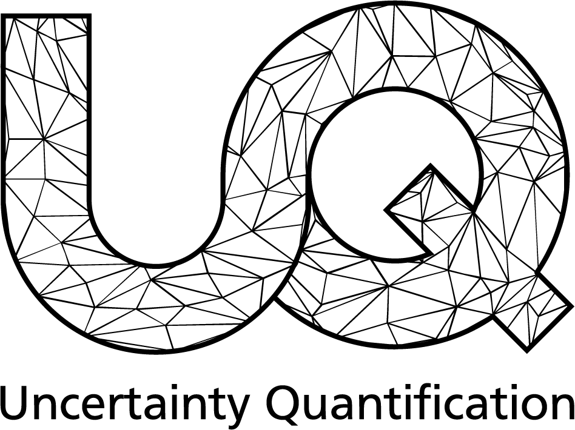

# Multichaos [](https://www.scc.kit.edu/forschung/uq.php)

`Multichaos` is a Python package for constructing polynomial chaos expansions (PCEs) of the form

$$
\begin{equation}
    \hat{Q}(\omega) = \sum_{\lambda \in \Lambda} c_{\lambda} P_{\lambda}(\omega),
\end{equation}
$$

for approximation of response surfaces $Q: \Omega \subset \mathbb{R}^d \rightarrow \mathbb{R}^k$.
Having access to only approximative response surfaces $Q_n: \Omega \rightarrow \mathbb{R}^k$ (e.g., from numerical simulations),
`Multichaos` combines multiple levels to balance accuracy and costs to obtain the most efficient PCE.
The underlying optimal least squares procedure is based on importance sampling to reduce the number of simulation runs required for even more efficiency.

For more information of the underlying theory, please refer to this [paper](https://www.esaim-m2an.org/articles/m2an/abs/2020/02/m2an170180/m2an170180.html).


## Installation
To install, you can `cd` into the multichaos directory and run
```
pip install .
```
## Documentation

#### Usage

Under Usage, we provide walkthroughs of the functionalities of Multichaos.

#### API Reference

The API reference contains detailed explanations of all software components of Multichaos, and how to use them.

## Acknowledgement and License

Multichaos is being developed in the research group [Uncertainty Quantification](https://www.scc.kit.edu/forschung/uq.php) at KIT.