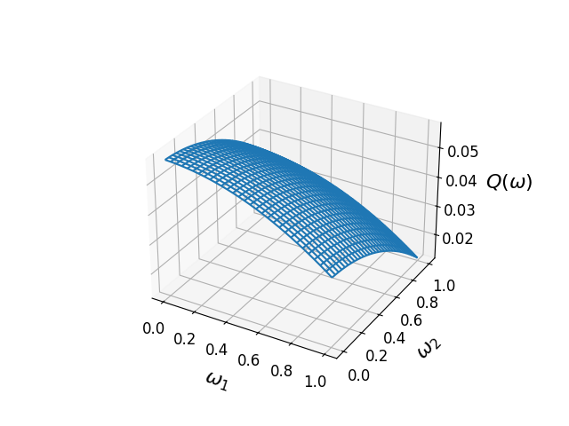
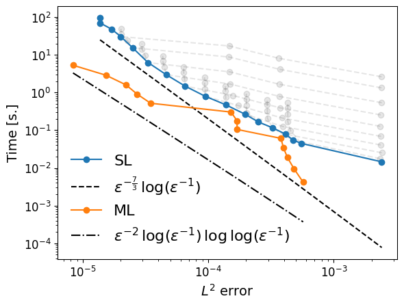

# Elliptic toy problem in 1D

### Problem setup

Consider the elliptic toy boundary-value problem

$$
\begin{align}
-\left(a(x, \omega) \, u' (x, \omega)\right)' &= g(x), \quad x \in U \subset \mathbb{R}, \\
u(x, \omega) &= 0, \quad x \in \partial U
\end{align}
$$

with $U = [0, 1]$ and random coefficient function $a: U \times \Omega \rightarrow \mathbb{R}$ on $\Omega := [-1, 1]^2$.
We choose a **uniform distribution** for $\omega$ on $\Omega$.
For simplicity, we choose the constant right-hand side $g \equiv 1$ and coefficient $a(x, \omega) = 1 + x + \Vert \omega \Vert_2^3$.
Given a **quantity of interest** (QoI) $q(u(\cdot, \omega)) \in \mathbb{R}$, we are interested in (approximating) the response surface

$$
\begin{align}
    Q: \Omega &\rightarrow \mathbb{R} \\
    \omega &\mapsto q(u(\cdot, \omega)).
\end{align}
$$

As QoI we choose the mean of the solution of the boundary-value problem over its domain $U$, that is $q(u(\cdot, \omega)) := \int_U u(x, \omega) \, dx$.
In this case, the response surface can be expressed analytically as

$$
\begin{equation}
Q(\omega) = \frac{3}{2} + c - \log \left(\frac{2 + c}{1 + c}\right)^{-1}
\end{equation}
$$

with $c = c(\omega) := \Vert \omega \Vert_2^3$, and looks something like this:

<figure markdown="span">
  { width="700" }
</figure>

## Polynomial chaos expansion (PCE)

Next, we want to approximate this response surface $Q$ using PCE onto a polynomial space $V$, which we denote by $\Pi_V Q$. 
Although an explicit solution for this problem exists, we pretend we do not have access and the use of numerical solvers is unavoidable.
Maybe we have implemented a response function that looks something like this:

```python
def response(omega: np.ndarray) -> float:
    # Solve the boundary-value problem
    u = solve_bvp(omega)
    # Compute the QoI
    q = np.trapz(u, dx=1/u.size)
    return q
```

To compute a PCE, we need to decide on the polynomial subspace to use.
Here, we choose total degree (TD) polynomial spaces of maximum degree $m=5$ in each dimension.
We can generate the corresponding multi-index set using `multichaos` as follows:
```python
from multichaos.index_set import generate_index_set

index_set = generate_index_set("TD", max_degree=5, dim=2)
```

Let's also define the uniform distribution for $\omega$ using `openturns`:

```python
import openturns as ot

dist = ot.joint(2 * [ot.Uniform(0, 1)])
```

Now, we can create a PCE instance using the `SingleLevelPCE` class from `multichaos`:

```python
from multichaos.single_level import SingleLevelPCE

pce = SingleLevelPCE(
    response=response,
    dist=dist,
    index_set=index_set,
)
```

Finally, we can run the `compute_coefficients` method to compute the PCE coefficients:

```python
pce.compute_coefficients()
```

Now we can evaluate the PCE on a new sample $\omega \in \Omega$ using `pce(omega)` or compute the mean of the QoI using `pce.compute_mean()`.


## Multi-level PCE

In the multi-level setting, we want to combine different levels of accuracy of the underlying numerical solver.
Assume therefore we have access to a hierarchy of approximative response surfaces

$$
\begin{align}
    Q_n: \Omega &\rightarrow \mathbb{R} \\
    \omega &\mapsto q(u_n(\cdot, \omega)),
\end{align}
$$

where $u_n$ is e.g., a finite-differences solution of the boundary-value problem using $n$ discretization points.
Obviously, the functions $Q_n$ increase in both accuracy and cost as $n$ increases.
For a fixed number of levels $L \in \mathbb{N}$, consider a sequence of increasing and sufficiently large discretization parameters $\{n_0, \ldots, n_L\} \in \mathbb{N}^{L+1}$. 
Consider the telescopic sum

$$
\begin{equation}
    Q \approx Q_{n_L} = Q_{n_0} + \sum_{l=0}^L Q_{n_l} - Q_{n_{l-1}}.
\end{equation}
$$

The multilevel idea is now to approximate each term in the sum using an independent (single-level) PCE, as introduced above.
Similary, consider a sequence of increasing polynomial space parameters $\{m_0, \ldots, m_L\} \in \mathbb{N}^{L+1}$,
and define the multilevel PCE as

$$
\begin{equation}
    \hat{Q} := \Pi_{V_{m_L}} Q_{n_0} + \sum_{l=0}^L \Pi_{V_{m_{L-l}}} (Q_{n_l} - Q_{n_{l-1}}),
\end{equation}
$$

where $V_m$ denotes the polynomial space associated to parameter $m$, e.g., the maximum degree in each dimension of the polynomial space.

To implement this using `multichaos`, we need to specify the rates for **convergence** and **cost** of the underlying numerical solver, as well as polynomial **approximability** and **dimensionality** of the sequence of polynomial spaces. Mathematically, we assume there exist $\beta, \gamma, \alpha, \sigma > 0$ such that

- $\|Q - Q_n\|_{L^2} \lesssim n^{-\beta}$
- $\text{Work}(Q_n) \lesssim n^{\gamma}$
- $\inf_{v \in V_m} \|Q - v\|_{L^2} \lesssim m^{-\alpha}$
- $\text{dim}(V_m) \lesssim m^{\sigma}$

In our example, using central finite differences as underyling solver, we have convergence rate $\beta = 1$ and work rate $\gamma = 1$.
Using total degree polynomial spaces, we have approximability rate $\alpha = 3$ and dimensionality rate $\sigma = 2$.
We need to pack these rates into a dictionary:

```python
rates = {
    "beta": 1,
    "gamma": 1,
    "alpha": 3,
    "sigma": 2,
}
```

Also, we need to pass the mapping $n \mapsto Q_n$ as an input to the `MultiLevelPCE` class, which could be done by wrapping the previously defined `response` function, where `solve_bvp` is called with a specific $n \in \mathbb{N}$:

```python
def get_n_response(n: int) -> Callable:
    def response(omega: np.ndarray) -> float:
        # Solve the boundary-value problem
        u = solve_bvp(omega, n=n)
        # Compute the QoI
        q = np.trapz(u, dx=1/n)
        return q
    return response
```
OR?
```python
get_n_response = lambda n: response(omega, n)
```


Now, we can create a `MultiLevelPCE`:

```python
from multichaos.multi_level import MultiLevelPCE

ml_pce = MultiLevelPCE(
    response=get_n_response,
    dist=dist,
    index_set_type="TD",
    rates=rates,
    tol=tol,
)
```

The parameter `tol` represents a tolerance $\epsilon > 0$ for the desired $L^2$ error, ensuring that

$$
\begin{equation}
    \|Q - \hat{Q}\|_{L^2} \leq \epsilon
\end{equation}
$$

holds. Finally, we can run the `compute_coefficients` method to compute the multilevel PCE coefficients:

```python
pce.compute_coefficients()
```

## Complexity analysis

According to theory, the computational costs for the (single-level) PCE to reach an error tolerance $\epsilon > 0$, behave asymptotically as

$$
\text{Work}(\Pi_{V_m} Q_n) \approx \epsilon^{- \gamma / \beta + \sigma / \alpha} \log \left(\epsilon^{-1}\right).
$$

On the other hand, using a multilevel PCE $\hat{Q}$,

$$
\begin{equation}
\text{Work} (\hat{Q}) \leq \epsilon^{- \lambda} \log (\epsilon^{-1})^t \log \log (\epsilon^{-1}),
\end{equation}
$$

where $\lambda = \max \left(\gamma / \beta,\, \sigma / \alpha\right)$ and

$$
t = \begin{cases}
    2, & \gamma / \beta < \sigma / \alpha, \\
    3 + \sigma / \alpha, & \gamma / \beta = \sigma / \alpha, \\
    1, & \gamma / \beta > \sigma / \alpha.
    \end{cases}
$$

To visualize this, we compute single-level PCEs $\Pi_{V_m} Q_n$ for diferent values of discretization $n$ and polynomial space parameters $m$.
Also, we compute several multilevel PCEs $\hat{Q}$ for different values of the tolerance $\epsilon > 0$.
The following figures show the $L^2$ error versus the costs (here, time) for each PCE, single- and multilevel, respectively.

<figure markdown="span">
  { width="600" }
</figure>

Each single-level PCE is represented by a gray dot, and the lower envelope (blue curve) of them is considered as the single-level complexity curve.
One can clearly observe that the computed rates fit the theoretical rates, and the multilevel PCEs are more efficient than standard PCEs.